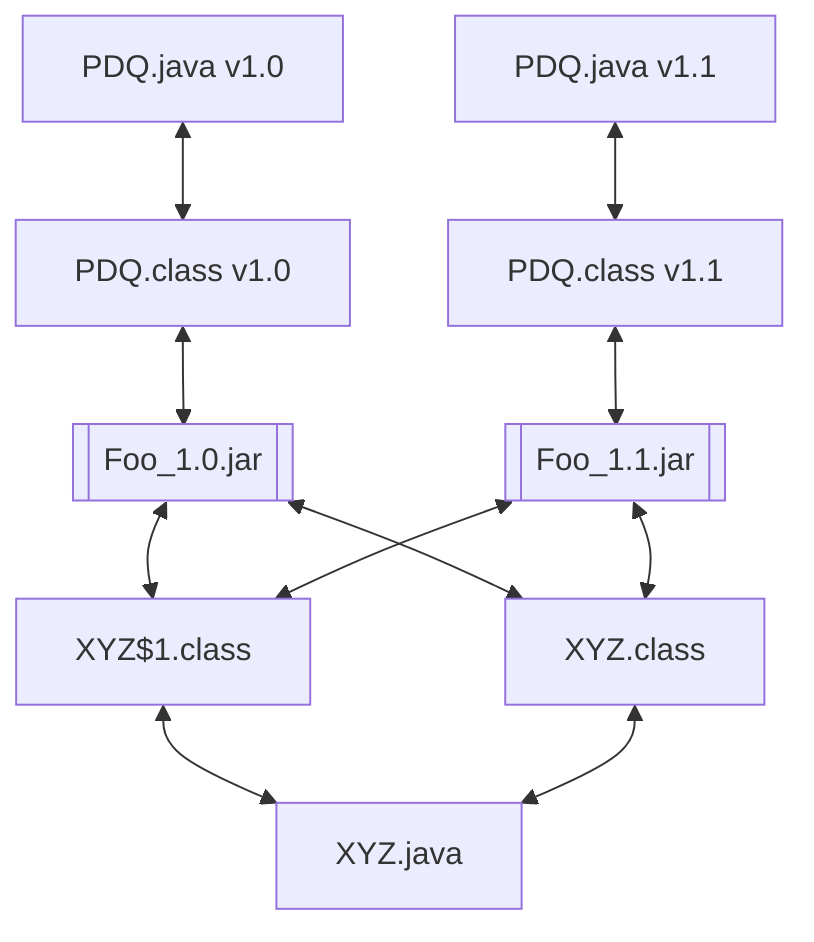

# Append-only Graph Database

The data stored in an OmniBOR Corpus (whether it's a corpus containing
open source or containing relationships in proprietary systems) is
a graph relationship with bi-directional indexing.

At a simple level:

In the above example, `Foo_1.0.jar` depends on `XYZ.java` and `PDQ.java v1.0` and the classfiles
generated from those source files. `Foo_1.1.jar` also depends on `XYZ.java` but on a different
version of `PDQ.java` (`v1.1`) and the related classes.

The graph allows for bi-directional traversal. Thus, queries such as, "what JAR files depend
on `PDQ.java v1.1`?" or "what class files are shared between `Foo_1.0.jar` and `Foo_1.1.jar`?"

At an intuitive level, this makes sense. However, at scale, there is a huge graph that will
be constantly updated. For example, the ~20M JAR files in Maven Central yield more than
325M verices and more than 10B edges. Being able to traverse the graph quickly and add
new vertices and assocaited edges to the graph becomes a very interesting challenge.

## Constraints Drive Design

When designing a system, enumerating and discussion constraints
helps drive the correct design choices. We will discuss constraints.

### Graph Format

All graphs are [directed and acyclic](https://en.wikipedia.org/wiki/Directed_acyclic_graph).

### Access Patterns

The corpus is heavily read-biased. Most corpus access will be graph walks based on
the primary key of a vertex (an [OmniBOR identifier](https://omnibor.io/), 
a [pURL](https://github.com/package-url/purl-spec), a hash, etc.) From a given vertex,
what are the edge?

It's unlikely that there will be a material difference in access patterns based on vertex
age. For example, JodaTime's `Seconds.java` file has more than 30,000 relationships (vertices
that directly or indirectly depend on the file) across Maven Central. And the `Seconds.java`
file has only been updated 
[4 times in the last 13 years](https://github.com/JodaOrg/joda-time/commits/v2.12.7/src/main/java/org/joda/time/Seconds.java).

### Update Patterns

### History Retention

### Multi-version

### Cryptographic Verification

### Incremental Distribution/Replication

## Other Art

### Probility of Hash Collision

`1 - e^(-k^2/2^(n+1))` where `k` is the number of items being hashed and and `n` is the number of bits:
https://stackoverflow.com/questions/62664761/probability-of-hash-collision

## Files and Data Structures

There are three classes of file that Goat Rodeo will emit:

* The OmniBOR Entry file (Goat Rodeo Data or `.grd`) which contains the substance of the data. The Goat Rodeo Data file should be named based
  on the hex value of the 8 most significant bytes of the file's SHA256 hash. This allows for a quick check. Every `.grd` file shall contain
  a back-pointer to the previous file (except the original file). Given that the database is accretive, newer files will reference
  previous files. 
* The Index file which contains the MD5 hash of the primary key, the Goat Rodeo Data (`.grd`) file that contains the entry, and the offset in that file. These files will be named based on the hex of 8 most significant bytes of the file's SHA256 hash with `.gri` appended.
  This is the Goat Rodeo Index `.gri` file. The indexes should be in ascending order.
* The Goat Rodeo Cluster (`.grc`) file which contains the ordered list of `.grd` files including SHA256 hash, the set of `.gri` files with SHA256 hash
  and database metadata. The `.grc` file will be named based on the time the file was created and hex value of the most significant 8 bytes of the SHA256 of the file's hash. For example `2024_04_30_18_23_07_334f42bf1be490ee.grc` The timestamp prefix allows for determining the newest or most
  recent cluster file.
