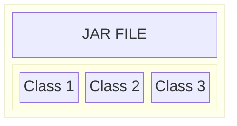
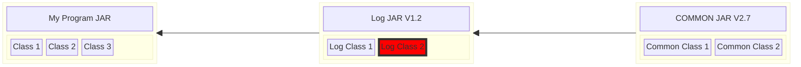
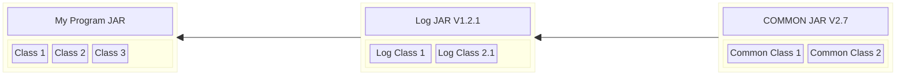
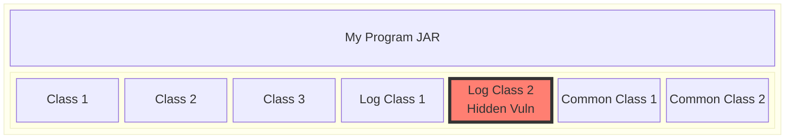

# Looking for Vulnerable Artifacts hidden in other Artifacts: Hidden Reapers

The [Java Virtual Machine](https://en.wikipedia.org/wiki/Java_virtual_machine) (JVM) is a seasoned
and very popular system for running applications, especially in the cloud and also on Android devices
(technically, Android devices run a clean-room reimplementation of the JVM).

The JVM executes an abstract stack-based machine code ([byte code](https://en.wikipedia.org/wiki/Java_virtual_machine#Bytecode_instructions))
the same way on all platforms. Thus, one can author and compile Java and JVM Compatible language
programs on a Windows machine running an ARM processor and run that code, unmodified, on a Linux 
machine with an x86 processor. Java's ongoing claim to fame is ["Write Once, Run Anywhere"](https://en.wikipedia.org/wiki/Write_once%2C_run_anywhere).

JVM byte-code and general operations are very well [defined and specified](https://docs.oracle.com/javase/specs/jvms/se8/html/index.html).

For the purposes of this discussion, we will focus on how JVM programs are distributed and how
JVM programs use open source libraries.

Each Java and JVM language source code file is compiled into a series of JVM "Class" files. There is
one [Class file for each JVM object-oriented class](https://docs.oracle.com/javase/specs/jvms/se8/html/jvms-4.html).

Even the most trivial JVM program will have dozens of classes and typical business application
will have thousands of classes.

In order to make distribution of the collection of class files that make up a Java program easier, classes
are typically packaged together in a "JAR" (Java ARchive) file. A [JAR file](https://docs.oracle.com/javase/tutorial/deployment/jar/basicsindex.html)
is simply a [Zip](https://en.wikipedia.org/wiki/ZIP_(file_format)) file with 
particular extra files in it.

Most JVM programs also use [open source](https://en.wikipedia.org/wiki/Open_source) libraries 
to perform functions in the program using common code and common patterns.

For example, most programs write status information in text format. For example, "Started
processing financial transaction XYZ for customer PDQ." The writing of status information
is termed "logging" and there are many libraries, including [Apache's](https://apache.org/)
[log4j](https://en.wikipedia.org/wiki/Log4j) library.

In order to manage libraries, the [Apache Maven](https://en.wikipedia.org/wiki/Apache_Maven)
project was created. Maven allows each artifact, wether that be a runnable program
or a library, to define the libraries that the the artifact depends on. This is called
a "dependency." It's also possible for one artifact's dependency to have other dependencies.
Dependencies that are defined by direct dependencies are called "transitive dependencies."
Maven resolves all the dependencies and fetches the artifacts from corporate artifact repositories 
as well as public open source artifact repositories including [Maven Central](https://central.sonatype.org/).

For example, if your program relies on "Log version 1.2" and that library relies on "Common version 2.7"
Maven (and other Maven compatible build/package systems) will fetch the appropriate artifacts and make
those artifacts available to the compiler and packaging system. The compiler translates human readable
source code into binary code that the machine (e.g, the JVM) can execute efficiently. The compiler
can also identify certain errors in code (e.g., treating a number as a string of characters). The
packaging system takes artifacts from the compiler (e.g., `.class` files) and bundles or
packages them together (e.g., into a JAR file).

## Vulnerabilities and Package Managers

Software does not always run the way the programmer intended it to run. Failure
to run as intended is called a ["bug"](https://en.wikipedia.org/wiki/Software_bug).

Some bugs could allow an actor to perform unwanted activities on the
machine where the software is running. These bugs are called ["vulnerabilities"](https://nvd.nist.gov/vuln).

[NIST](https://www.nist.gov/) and other organizations have created a common way of describing
and communicating information about vulnerabilities: ["Common Vulnerabilities and Exposures"](https://en.wikipedia.org/wiki/Common_Vulnerabilities_and_Exposures) or "CVEs".

Security researchers will identify vulnerabilities in software and assign a CVE number
to the vulnerabilities. There are [databases](https://osv.dev/) that allow anyone to learn
about the vulnerabilities in software.

Vulnerabilities that allow an adversary to take control of a machine running software
are called "Remote Code Execution" or RCE vulnerabilities and they are typically graded as
"Critical." Thus, anyone using libraries that contain a CVE that describes an RCE should
immediately upgrade to a version of the library that does not contain the critical vulnerability.

Because package managers, e.g., Maven, know the specific version of all the dependencies
and transitive dependencies, it's easy to determine if a particular library has a Critical or
High CVE.

In the above diagram, the `Log Class 2` class has a Critical vulnerability. A developer can update the
library version in Maven to "Log v1.2.1" which remediates the vulnerability:

## But sometimes developers don't use the dependency management tools

Sometimes, for valid technical reasons, developers may choose not to use Maven or another
build tool to define some of a program's dependencies. Instead the developer will copy the source code
from a particular library into their project.
This will result in code being part of an executable artifact, but hidden
from common tool like [Dep-Scan](https://github.com/owasp-dep-scan/dep-scan) or [Snyk](https://snyk.io)
as well as other security vulnerability scanning and management tools
(e.g., Checkmarx, GitHub, Veracode, etc.)

For example, if the vulnerable version of "Log V1.2" was compiled into
an application, the JAR would look like:

And this would mean the commonly used security tools would miss the dependency...
it would be a hidden vulnerability... a **Hidden Reaper**.

## Artifact Dependency Graph

Rather than relying on the build tool to generate a list of dependent
packages, building a set of connections among every part of every artifact
allows for the use of math to irrefutably demonstrate that many
artifacts share common files and components.

We can calculate when an artifact shares part of its dependency graph with another artifact. 

This is similar to DNA tests for pets. The breeder may have told you you have a labradoodle,
but somehow there's a lot of chihuahua in your dog.

What a breeder tells you is in your dog is what the build tool tells you. What
a DNA test tells you is what the Artifact Dependency Graph tells you.
And sometimes a DNA test allows you to uncover that your pet may be genetically predisposed to
a health issue or risk.

## Finding the Hidden Reapers

Spice Labs has generated an Artifact Dependency Graph, the [SaLAD](https://spicesalad.com), that
has DNA markers for more than 2B items and the relationship
among those items.

With the SaLAD, Spice Labs can identify hidden dependencies... 
Hidden Reapers... in open source and proprietary code. 

This allows Spice Labs to use an open source tool to build an 
Artifact Dependency Graph of proprietary artifacts and then compare the DNA of the 
corporate artifacts against a Naught Spice List of known bad open source packages. 

Thus, Spice Labs can find the Hidden Reapers in a company's proprietary
code... Vulnerabilities that leading security tools 
(Checkmarx, GitHub, Snyk, Veracode, and many others) cannot find.

## Finding Hidden Reaper artifacts based on the Grim List

Spice Labs' SaLAD contains the [gitoids](https://www.iana.org/assignments/uri-schemes/prov/gitoid)
for artifacts in many different open source ecosystems including the JVM/Java ecosystem.

An artifact is an array of bytes. An artifact may be a Java `.class` file, it may be an
image, it may be a Java [JAR](https://docs.oracle.com/javase/tutorial/deployment/jar/basicsindex.html)
file, it may be a `.deb` package, etc.

Spice Labs has created a graph of more than 2B vertices describing the relationship
among many open source artifacts.

## JAR files and Dependencies

The most prevelant mechanism for for building and packaging Java (and Scala/Kotlin/etc.)
programs involed using [Maven](https://maven.apache.org/) or a compatible tool
(e.g., [sbt](https://www.scala-sbt.org/), [Gradle](https://gradle.org/)).

These tools allow engineers to define the packages their programs depend
on. These packages are fetched from an artifact repository 
(e.g., [Maven Central](https://central.sonatype.com/?smo=true))
and made available as part of the build and packaging process.

When an engineer declares dependencies in the build tool, those
dependencies are listed and can be used to check if a particular
artifact depends on any other artifacts with known vulnerabilities.

However, sometimes engineers copy/paste source code from projects into their
project. When projects with copied/pasted code is built, the dependencies
are hidden.

When these hidden dependencies have **critical** vulnerabilities,
we call this "Hidden Reaper".

## Markers

"Markers" are the artifacts unique to a particular artifact. What?

Let's say we have a package, Foo that has three versions, 1.0, 1.1, and
1.2. Package Foo contains three artifacts: Foo:1.0, Foo:1.1, Foo:1.2.

The artifacts are made up of artifacts... class files, license files, etc.
all rolled together in a JAR file (we're in JVM-land).

The three artifacts will share many artifacts: class files derived
from source files that are stable across all three versions, etc.

However, there will be artifacts (e.g., `.class` files) that are unique
to each version of Foo. These are "markers."

If these "marker" artifacts are contained by other artifacts, those
containing artifacts will very likely contain a particular
version of Foo, even if that version of Foo was not declared
as a dependency.

## Detecting Hidden Reapers

Spice Labs has taken GitHub's [Advisory Database](https://github.com/advisories)
and found all Java/JVM packages that have critical vulnerabilities.

For each artifact (package + version), the vulnerabilities for that artifact
have been pulled from [OSV](https://osv.dev/).

Artifacts with critical vulnerabilities are Reapers.

For each artifact in each package with critical vulnerabilities, Spice Labs has computed
the "markers" for that artifact.

Spice Labs then uses these markers to locate other artifacts
that Hide the Reapers.

## Using the Hidden Reaper Unmasking tool

Goat Rodeo (this project) is published as a [Docker](https://en.wikipedia.org/wiki/Docker_(software))
container that you can use to unmask Hidden Reapers in your code.

Create a directory (e.g., `test_data`) and copy some artifacts (JAR files, Docker image layers (in `tar` format), etc)
into that directory. Then run:

`docker run --rm --network none -v $(pwd)/test_data:/jars_to_test:ro spicelabs/goatrodeo:latest --unmask --out stderr 2> /tmp/hidden_reapers.json`

